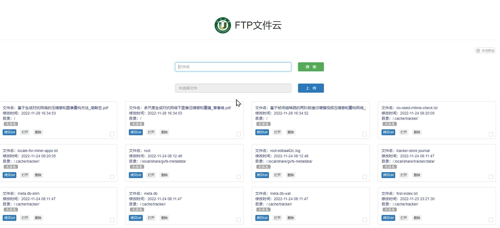

# 介绍

## 极速+轻量化+私有文献搜索引擎```YaoKY```
## 帮助每个人打造自己专属方向的文献数据库




<div style="text-align: center;">
    <iframe src="//player.bilibili.com/player.html?aid=578919061&bvid=BV1E64y177dE&cid=1347370865&p=1" 
            scrolling="no" border="0" frameborder="no" 
            framespacing="0" allowfullscreen="true">
    </iframe>
</div>

众所周知，windows下有一款搜索文件飞快的软件，everything，可以毫秒级的速度找到电脑上所有文件名与搜索类似的文件
而在linux系统下也有类似的需求，但现有的搜索工具都是基于命令行的，非常不友好

> 于是一个针对快速查阅上万篇论文，模糊搜索并预览的YaoKY诞生了，它的特点有：
* 模糊搜索关键字，在10G文件达到毫秒级响应结果
```
简单搜索的核心引擎使用python编写服务接口
技术栈并不复杂涉及：
Token语义分词，近似搜索Levenshtein最短编辑距离，
压缩前缀树Trie Tree实现完全匹配的O(1)复杂度搜索，
分词多任务并行查找，相似度合并排序，索引缓存的建立。
```
* 允许一次性拖拽上传多个文件
* 允许多选复制文件Url，方便分享论文给课题组其他成员
* 可以在线直接预览pdf和图片文件，无需下载
* 配合我写的Tampermonkey插件，纯js实现，可以实现影响因子，期刊名等信息一并展示
ask：为什么不把这个脚本直接放项目里，要完善的还很多，api也不是那么稳定，因此暂时做成脚本的形式

预备条件：自己一台完备的服务器且配置好FTP服务，这个网页主要作用是显示和查找，因为网页无法上传文件夹
* 前端：bootstrap，layui组件，jquery和Vue进行数据操作
* 后端：很简单的SpringBoot，完成上传、查询、删除接口即可
检索影响因子：Tampermonkey脚本这一部分工作量算是最大的，基于对scihub api的请求改到对自己网页检索可用，遍历几十条ajax速度太慢了
，但又不像其他检索网站会显示期刊号和名称等信息，只能根据文献名称请求查询响应速度...可用就行。


效果如图所示
需要修改的地方：
```java
/**
 * 1、FileUploadController.java中，需要修改自己的服务器的url
 */
public static String serverUrl = "http://xx.xx.xx.xx:y/file/";
```
```java
/**
 * 2、FileUploadController.java中，pic_path也需要修改
 */
if ("bin".equals(bin_path)) {
    pic_path = tomcat_path.substring(0, System.getProperty("user.dir").lastIndexOf("/")) + "/../../ftpServer/ftprepository/";
} else {
    pic_path = tomcat_path + "/../../ftpServer/ftprepository/";
}
```
```javascript
//3、index.html和ftp.html中
//输入你想要的md5验证密码
//例如'14e1b600b1fd579f47433b88e8d85291'代表123456
//双md5是逆向解密不了的，直接放前端也是几乎100%安全的
if (pwd_md5 == '14e1b600b1fd579f47433b88e8d85291'){
    //...
}
```

maven项目打包和部署的步骤不作赘述

实现的效果如图

> 1、查看文献||显示预览图


>2、搜索文献||直接打开链接


>3、影响因子插件效果
